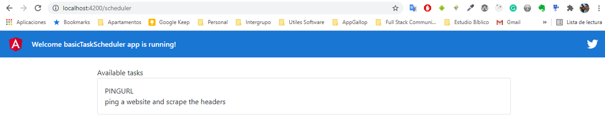
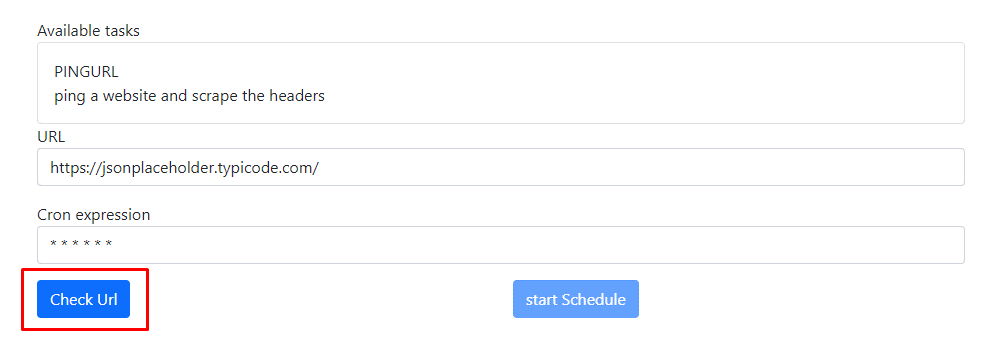
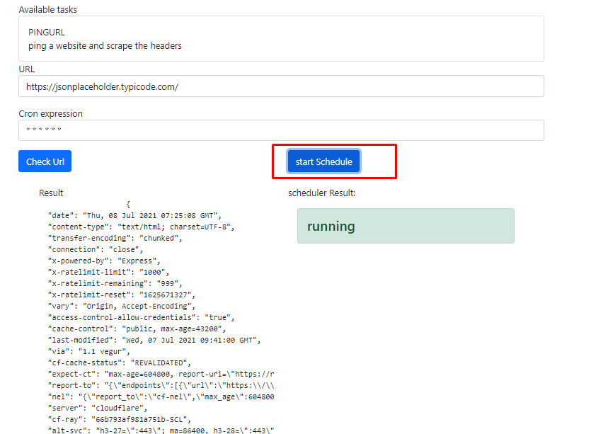
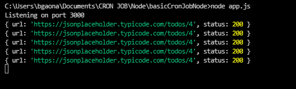

# Basic scheduler Angular

## Instalation
Go to `basicTaskScheduler` folder and then install
```bash
npm install
```
## Backend
Remember to run the node application found in: https://github.com/bgaona/basicCronJobNode

## Configuration
you can modify api settings in `proxy.conf.json` file.
## Run application
```bash
npm start
```

## Usage
1. Available tasks will be displayed, this is returned by the service


2. Select available task
3. Enter the information and click the "Check Url" button

4. If you want you can run the task according to the cron expression. Click the "start schedule" button


## The job according to the cron expression will be executed from the node application
